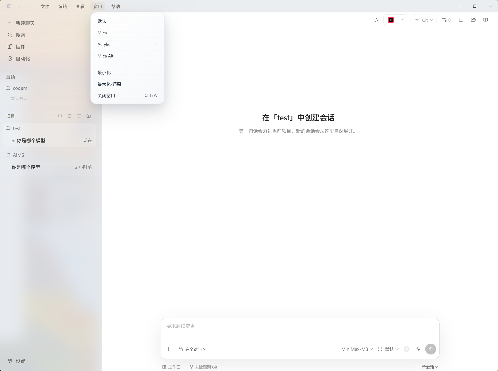
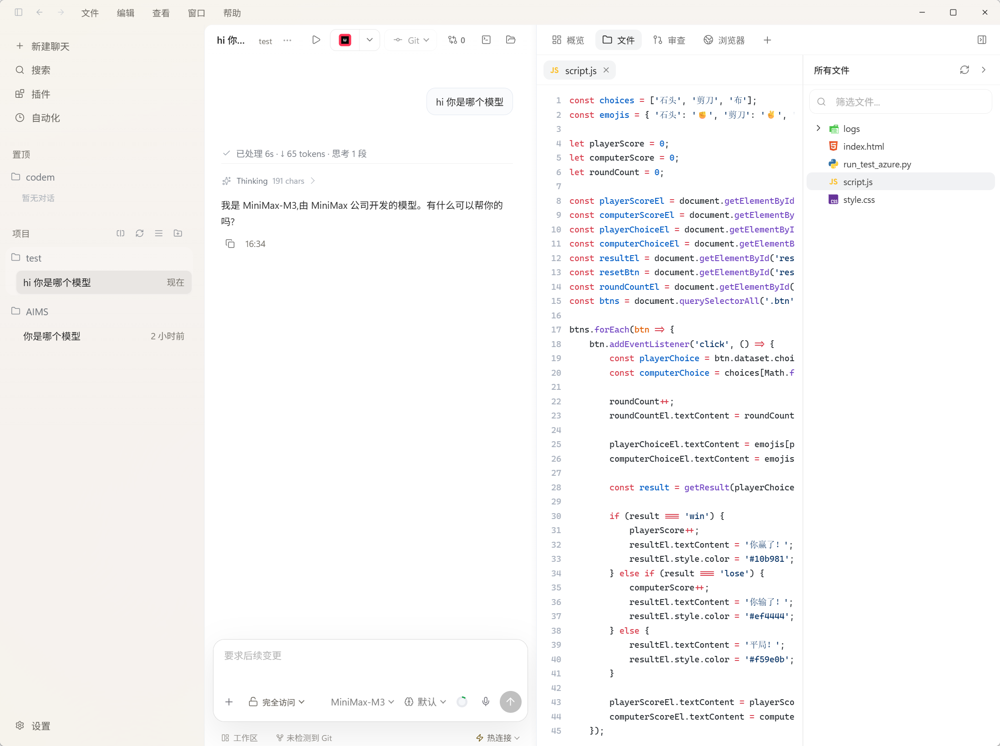
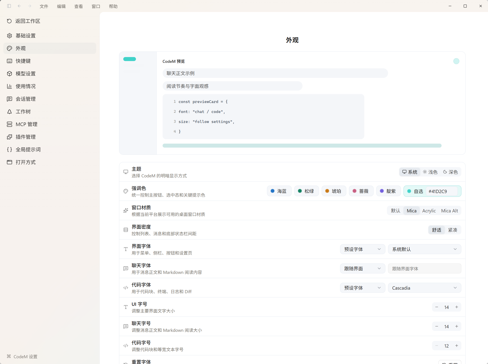
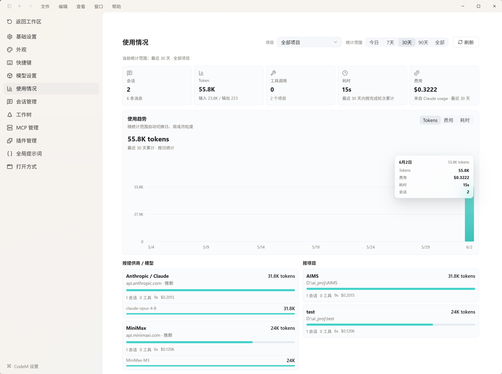

# CodeM

CodeM 是一个给 Claude Code 用的本地桌面壳。

它把本机 `claude` CLI 包成图形界面，让你可以在一个桌面应用里管理项目、继续会话、查看运行过程、处理权限确认，并把聊天记录和项目状态保存在本机。

> 当前阶段 CodeM 主要是 Claude Code 的图形界面，不是独立模型平台。后续可以继续扩展其他 provider，但现在先把 Claude Code 的本地工作流做好。

## 界面预览

### 主界面

项目和会话集中在左侧，当前会话在中间展开，底部输入框保留权限、模型和运行状态。



### 工作台

对话、文件和项目上下文可以放在同一个窗口里，日常写代码时不用在终端和文件管理器之间来回切。



### 外观设置

主题、强调色、窗口材质、界面密度和字体可以在设置里调整，尽量贴合自己的桌面环境。



### 使用情况

内置使用情况视图，用来查看会话、Token、耗时和费用的简单统计。



## 当前能做什么

- 调用本机 `claude` CLI，并实时展示 Claude Code 的输出
- 按项目管理聊天，会话可以继续复用 `sessionId`
- 支持切换工作目录、停止运行、继续输入和队列发送
- 支持默认、自动执行、完全访问三档权限模式
- 支持 Plan 确认、权限审批和 AI 提问卡片
- 支持 Markdown / GFM 渲染，工具调用会折叠展示
- 支持 `TodoWrite` 计划卡片和运行状态展示
- 支持项目级 Git 分支和变更数量展示
- 支持工作台视图，可以查看文件、审查、浏览器等区域
- 支持主题、强调色、窗口材质、界面密度和字体设置
- 项目、线程、消息和工具调用会持久化到本机 SQLite

## 快速开始

先确认本机已经安装并登录 Claude Code，并且终端里可以执行：

```bash
claude --help
```

安装依赖：

```bash
npm install
```

启动 Web 开发模式：

```bash
npm run dev
```

默认地址：

- 前端：`http://127.0.0.1:5173`
- 后端：默认 `http://127.0.0.1:3001`，如果端口不可用会自动切换
- 本地数据库：`%LOCALAPPDATA%\CodeM\codem.sqlite`

## 桌面开发

```bash
npm run desktop:dev
```

桌面开发模式使用 Tauri，并会尽量复用当前仓库正在运行的 Web 和后端服务：

- `src/**` 改动通过 Vite HMR 即时刷新
- `server/**` 改动通过 `tsx watch` 自动重启后端
- `src-tauri/**` 改动通过 `tauri dev` 自动重编译并重启桌面壳

## 使用方式

1. 确保当前机器可以执行 `claude --help`
2. 启动 CodeM
3. 在左侧选择或添加项目目录
4. 在输入框输入需求并发送
5. 当前线程默认续聊，新建聊天不会删除旧线程

建议只在可信目录里使用“完全访问”权限模式。这个模式会让 Claude Code 跳过部分权限确认，适合自己的开发目录，不适合陌生代码仓库。

## 技术栈

- 前端：React + Vite
- 桌面壳：Tauri
- 后端：Node.js + Express
- Claude 调用：本机 `claude` CLI
- 本地持久化：Node.js 内置 `node:sqlite`

## 打包

打包前先检查本机基础环境：

```bash
npm run package:doctor
```

常用入口：

```bash
npm run package:win:with-node       # Windows x64，内置 Node.js
npm run package:win:no-node         # Windows x64，依赖系统 Node.js
npm run package:mac-arm64:with-node # macOS Apple Silicon，内置 Node.js
npm run package:mac-arm64:no-node   # macOS Apple Silicon，依赖系统 Node.js
npm run package:mac-x64:with-node   # macOS Intel，内置 Node.js
npm run package:mac-x64:no-node     # macOS Intel，依赖系统 Node.js
npm run package:mac-universal       # macOS Universal
npm run package:linux:with-node     # Linux x64，内置 Node.js
npm run package:linux:no-node       # Linux x64，依赖系统 Node.js
npm run package:all                 # 当前系统推荐目标
```

`with-node` 表示安装包内置运行时 Node.js，目标机器不需要额外安装 Node。`no-node` 表示安装包不携带 Node.js，体积更小，但目标机器需要自行提供可用的 Node 环境。

应用内自动更新默认只覆盖 GitHub Release 中的 `with-node` 安装版。发布 workflow 会为 `with-node` 产物生成 Tauri updater 签名和 `latest.json`；`no-node` 和绿色版仍作为手动下载包保留。启用 release 自动更新前，需要在 GitHub Secrets 中配置 `TAURI_SIGNING_PRIVATE_KEY`，如果私钥设置了密码，还需要配置 `TAURI_SIGNING_PRIVATE_KEY_PASSWORD`。

## 当前边界

- 目前主要支持 Claude Code，不要把它理解成已经完成的多模型客户端
- Claude CLI 参数如果未来变动，后端桥接需要同步调整
- Plan、审批、AI 提问会暂停等待用户决策
- 线程历史持久化以 CodeM 自己的 SQLite 为主，Claude transcript 作为导入与补录来源
- 模型内部隐藏思考链不会展示，界面只展示 Claude CLI 在 `stream-json` 中实际暴露的事件

## 开发文档

- 开发规范入口：`.trellis/workflow.md`（后续非临时改动必须按 Trellis 记录任务、session、边界和验收）
- Trellis CLI：`npm run trellis -- start <topic> --title "任务标题"`，之后用 `record`、`verify`、`complete` 形成 session record 闭环
- frontend 规范：`.trellis/spec/frontend/`
- backend 规范：`.trellis/spec/backend/`
- 思考指南：`.trellis/spec/guides/`
- 开发任务沉淀：`.trellis/tasks/`
- 行为提案与变更记录：`openspec/README.md`
- 详细需求与演进路线：`requirements.md`
- 后续开发路线图：`roadmap.md`
